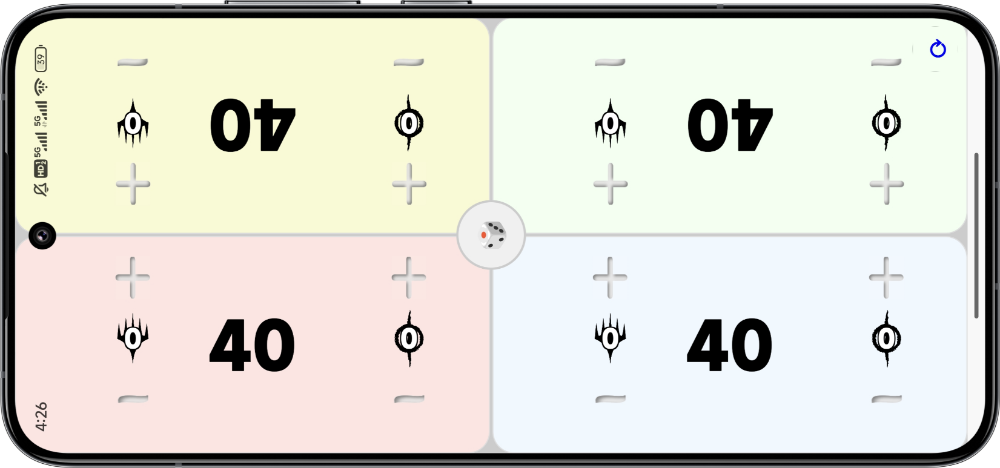

蒸汽仆役Steamer-s-Servant是一款个人开发的万智牌edh计血器应用，同时可以记录指挥官伤害、中毒指示物

发布于安卓（因为没有苹果证书）

支持掷骰子功能

点击计血器的上半部分可以加一滴血，点击下半部分可以减一滴血。长按可以一次性加减10点血

--------------------------
利用uni-app框架开发

本来想发布到微信小程序但是小程序备案和认证比较繁琐而且收费www

技术力比较低，只有基础功能，软件体积没有经过优化。大佬慎看。

由于是自己做着玩的所以更新什么的就随缘了qwq

有问题或建议或合作开发意向请反馈！！！

---

## English Version

Steamer-s-Servant is a personal Magic: The Gathering EDH life counter application that can also record commander damage and poison counters.

Released on Android (due to lack of Apple certificate)

Supports dice rolling functionality

Click the upper half of the life counter to add 1 life point, click the lower half to subtract 1 life point. Long press to add or subtract 10 life points at once.

--------------------------
Developed using the uni-app framework

Originally planned to release on WeChat Mini Program, but the registration and certification process is cumbersome and requires payment

Limited technical skills, only basic functionality, app size not optimized. Experts please be advised.

Updates are occasional since this is a personal project

Please provide feedback if you have any questions, suggestions, or collaboration ideas!

